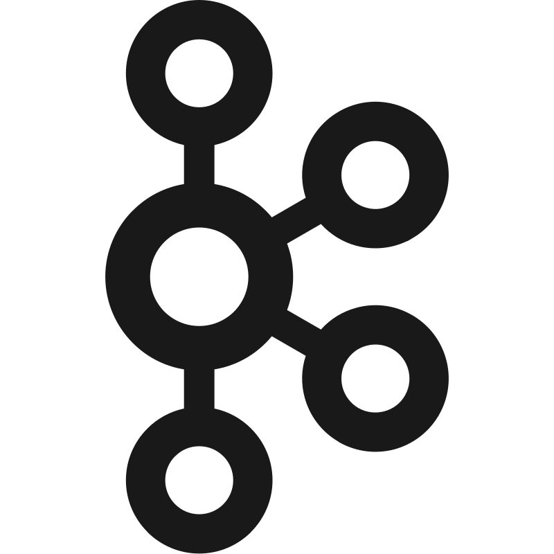

<!-- Header -->

<!-- Title -->

### 🙇🏻 Information
  

 <i>• Have knowledge on software development projects (full project cycle, including: initiating, planning, executing, monitoring, controlling, testing and closure phases).</i>
 <i>• Hard work - progressive - eager.</i>
 <i>• Strong in research & development, also willing to learn new technologies.</i>
 <i>• Logical thinking and solving technical issue independent.</i>
  <b>Core Competencies</b>
  <i>• Offshoring / Outsourcing</i>
  <i>• Programming/Testing</i>
  <i>• Requirement/Problem Analysis</i>
  <i>• Code Quality Assurance </i>
  <i>• Sharing Knowledge/Learning</i>
  <i>• Teamwork</i>
 

<table style="border-collapse: collapse; width: 100%; border: none;">
  <tr style="border: none;">
    <td style="border: none; width: 50%;">
      
    </td>
    <td style="border: none; width: 50%;">
      
    </td>
  </tr>
</table>

<h2 align="left" id="macropower-tech">Favorite Tech</h2>
### Tools, languages, and other things that I like to work with.
  
<table style="background: white">
  <tr>
    <td align="center" width="96">
      
       Java
    </td>
    <td align="center" width="96">
      
       Python
    </td>
    <td align="center" width="96">
      
       NodeJS
    </td>
    <td align="center" width="96">
      
       TypeScript
    </td>
    <td align="center" width="96">
      
       Kubernetes
    </td>
    <td align="center" width="96"> 
      
       Docker
    </td>
    <td align="center"  width="96">
      
       Spring
    </td>
    <td align="center" width="96">
      
       Postgresql
    </td>
  </tr>
   <tr>
    <td align="center" width="96">
      
       MySQL
    </td>
    <td align="center" width="96">
      
       Redis
    </td>
    <td align="center" width="96">
      
       Kafka
    </td>
    <td align="center" width="96">
      
       Jira
    </td>
    <td align="center" width="96">
      
       Cocos Creator
    </td>
    <td align="center" width="96"> 
      
       Docker
    </td>
    <td align="center"  width="96">
      
       React
    </td>
    <td align="center" width="96">
      
       Hasura
    </td>
  </tr>
</table>

Like My Work?

